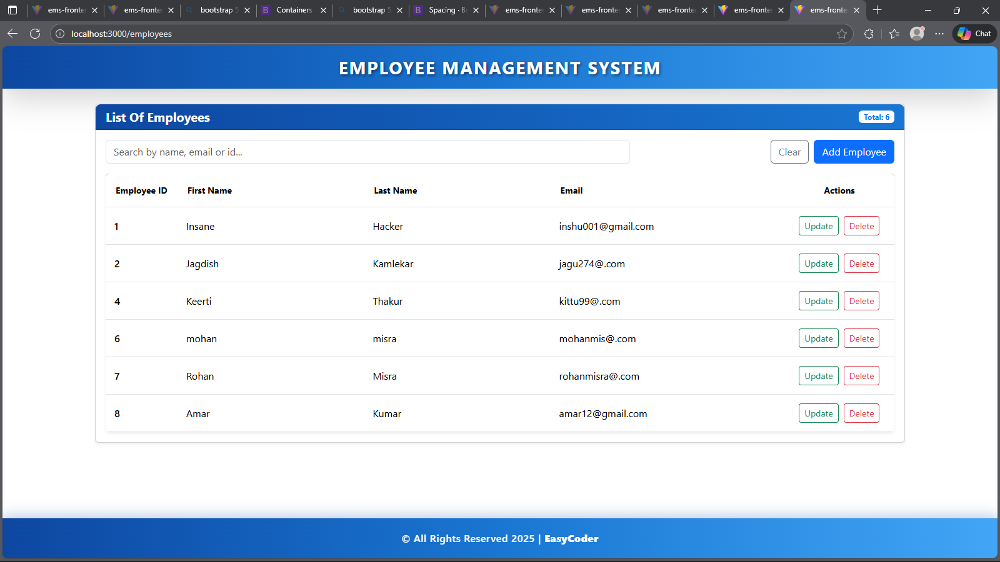
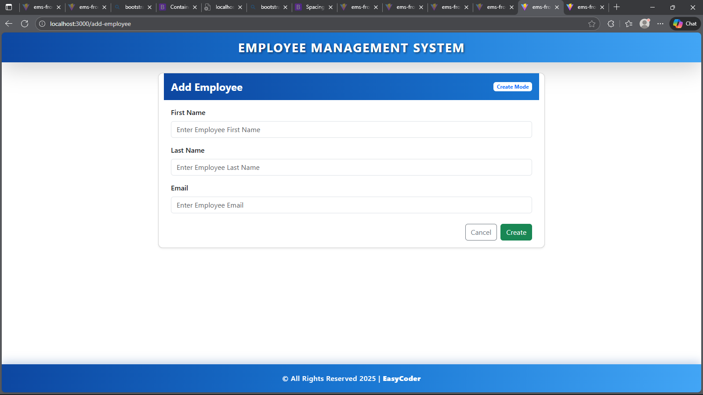
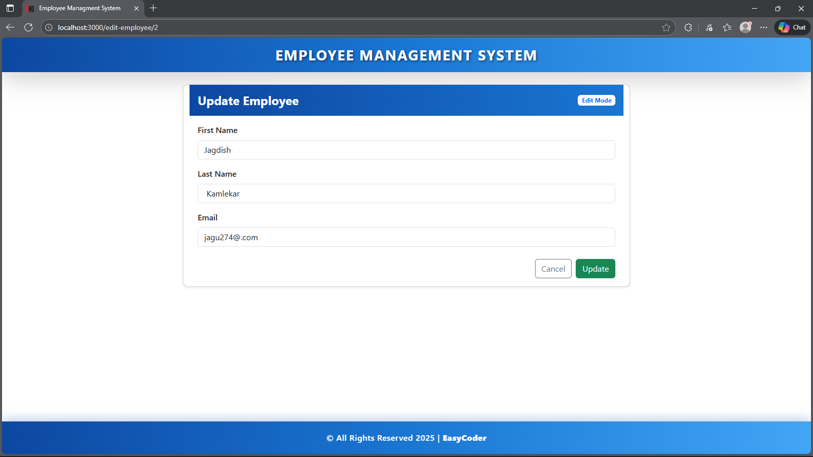

# Employee-Management-System-Spring-Boot-React
Full CRUD implementation showcasing a robust RESTful API built with Java and Spring, consumed by a modern React Single Page Application (SPA)

# 🚀 Employee Management System (Full Stack)

A full-stack web application for managing employee data. This project demonstrates a **RESTful API** backend built with **Spring Boot** and a responsive frontend built with **React** and **Bootstrap**.

## 📸 Screenshots


*List of Employees with Search functionality*

| Add Employee | Update Employee |
|:---:|:---:|
|  |  |

## 🛠️ Tech Stack

### Backend
* **Java 17+**
* **Spring Boot** (Web, Data JPA)
* **MySQL** (Database)
* **Hibernate** (ORM)
* **Maven** (Build Tool)

### Frontend
* **React.js** (Functional Components, Hooks)
* **Axios** (HTTP Client)
* **Bootstrap 5** (Styling & Responsive Design)
* **React Router DOM** (Navigation)

## ✨ Features

* **Create Employee:** Add new employees with validation.
* **Read Employees:** View a list of all employees with dynamic search/filtering.
* **Update Employee:** Edit existing employee details (pre-filled forms).
* **Delete Employee:** Remove employees with confirmation prompts.
* **Search:** Filter employees by Name, Email, or ID in real-time.
* **Responsive UI:** Works on desktop and mobile.

## ⚙️ Setup & Installation

### 1. Backend Setup (Spring Boot)
1.  Clone the repository.
2.  Create a MySQL database named `ems`.
3.  Open `src/main/resources/application.properties` and configure your database credentials:
    ```properties
    spring.datasource.url=jdbc:mysql://localhost:3306/Your_Database_name
    spring.datasource.username=root
    spring.datasource.password=YourPassword
    ```
4.  Run the Spring Boot application (The server will start on port `8080`).

### 2. Frontend Setup (React)
1.  Navigate to the frontend folder:
    ```bash
    cd ems-frontend
    ```
2.  Install dependencies:
    ```bash
    npm install
    ```
3.  Run the development server:
    ```bash
    npm run dev
    # OR
    npm start
    ```
4.  Open `http://localhost:3000` (or the port shown in your terminal) in your browser.

## 🔌 API Endpoints

| Method | Endpoint | Description |
| :--- | :--- | :--- |
| **GET** | `/api/employees` | Get all employees |
| **POST** | `/api/employees` | Create a new employee |
| **GET** | `/api/employees/{id}` | Get employee by ID |
| **PUT** | `/api/employees/{id}` | Update an employee |
| **DELETE** | `/api/employees/{id}` | Delete an employee |

## 👤 Author
**EasyCoder**
* Full Stack Developer

## 📄 License
This project is licensed under the MIT License.
